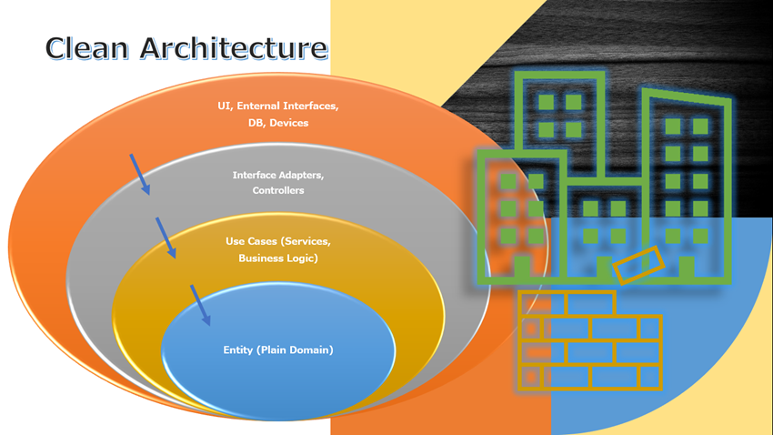

<h1 align="center">Jobber Ecommerce</h1>

Ecommerce marketplace app using event-driven Microservices with Node, Typescript, Kubernetes, Terraform, AWS and React. 
This repo contains all codes for the ECommerce freelance marketplace application.

 

> ## Jobber Client
* The `jobber-client` folder contains the frontend code.
* The frontend application is built using `React`, `Typescript` and `Tailwindcss`.
* The mobile application is built using `React Native`, `Typescript` and `NativeBase`.
  

> ## Microservices
* The `microservices` folder contains all the backend code for the application's services.
* The services can be started either individually from the terminal or via docker compose.
* The microservices are built using `TypeScript`, `Clean Architecture`, `SOLID`, `ExpressJS`, `Jest`, `RabbitMQ` and other technologies.
* [Microservices README file](https://github.com/vynnydev/jobberapp-microservices/blob/main/microservices/README.md)

  

> ## Microservices Design Patterns & Principles

* 1 - Entity:  

    * Purpose: Represents the main entities or domain objects of the application, such as business objects. They contain only domain-related logic and have no knowledge of implementation details, such as databases or user interfaces. 
    Dependencies: Should not depend on any other layer, especially technical details. 

* 2 - Use Case: 

    * Purpose: Defines the application's use cases. Each use case is a specific functionality or task that the application can perform. It contains the business logic and coordinates the interaction between entities. 
    Dependencies: Can depend on entities, but should not depend directly on technical details such as user interfaces or databases. 

* 3 - Interface and Adapter: 

    * Purpose: This layer deals with interaction with the world outside the application, such as user interfaces, external APIs or databases. Interfaces define the contracts that the application needs to implement, while adapters provide the actual implementation to fulfill these contracts. 
    Dependencies: May depend on use cases and entities, but should not depend on specific technical details such as frameworks. 

* 4 - Framework: 

    * Purpose: This layer contains technical details and concrete implementations of frameworks, libraries and external components. It communicates with the operating system, databases, web services etc. 
    Dependencies: It may depend on the other layers of the application to provide specific functionality, but the internal layers should not depend on it directly. 

    * Clean Architecture emphasizes the clear separation of responsibilities between these layers, with the internal layers (entities and use cases) being independent of the external layers (interfaces and adapters, and frameworks). This facilitates the maintenance, testability and evolution of the application, making it more scalable and adaptable to changes in requirements and technologies. 

* Principles

    * Single Responsibility Principle (SRP)
    * Open Closed Principle (OCP)
    * Liskov Substitution Principle (LSP)
    * Interface Segregation Principle (ISP)
    * Dependency Inversion Principle (DIP)
    * Separation of Concerns (SOC)
    * Don't Repeat Yourself (DRY)
    * You Aren't Gonna Need It (YAGNI)
    * Keep It Simple, Silly (KISS)
    * Composition Over Inheritance
    * Small Commits

* Design Patterns

    * Factory
    * Adapter
    * Composite
    * Decorator
    * Proxy
    * Dependency Injection
    * Abstract Server
    * Singleton

* Methodologies and Designs

    * Clean Architecture
    * DDD
    * Conventional Commits
    * GitFlow
    * Modular Design
    * Dependency Diagrams
    * Use Cases
    * Continuous Integration
    * Continuous Delivery
    * Continuous Deployment
  

> ## Microservices Architecture:

  

> ## Messaging Broker Architecture:

  

> ## Infraestructure
* The `volumes` folder contains files that are used to run services for local development.
* [Volumes README file](https://github.com/vynnydev/jobberapp-microservices/blob/main/infraestructure/volumes/README.md)
* The `terraform` folder contains files that are used to build infraestructure in AWS cloud to run services
  

> ## Kubernetes
* The `jobber-k8s` folder contains the objects code needed to deploy the microservices to kubernetes.
* The microservices are deployed to both `Minikube` and `AWS EKS Cluster`.
  

> ## Microservices on AWS:

