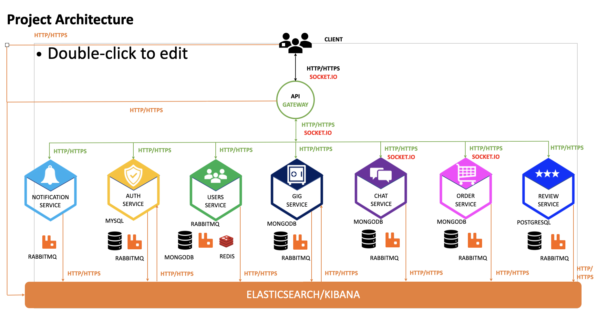
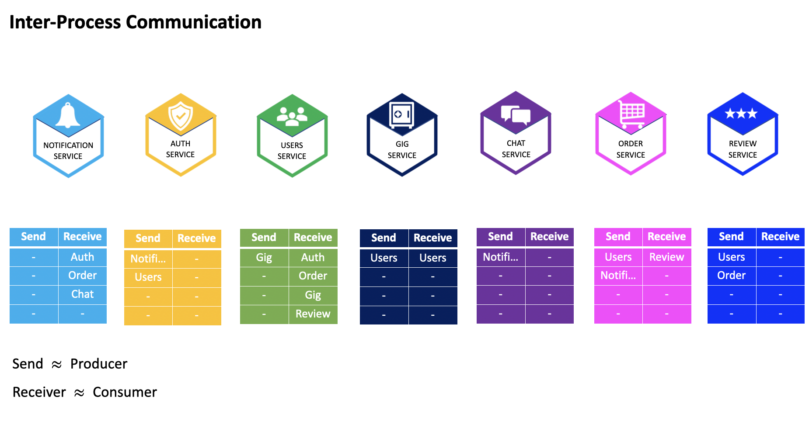
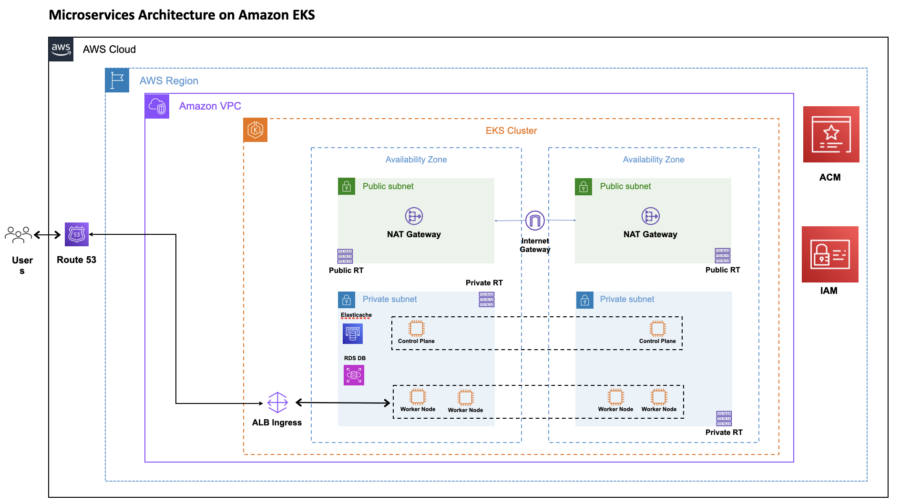

This repo contains all codes for the ECommerce freelance marketplace application.

> ## Jobber Client
* The `jobber-client` folder contains the frontend code.
* The frontend application is built using `React`, `Typescript` and `Tailwindcss`.
* The mobile application is built using `React Native`, `Typescript` and `NativeBase`.
  

> ## Kubernetes
* The `jobber-k8s` folder contains the objects code needed to deploy the microservices to kubernetes.
* The microservices are deployed to both `Minikube` and `AWS EKS Cluster`.
  

> ## Microservices
* The `microservices` folder contains all the backend code for the application's services.
* The services can be started either individually from the terminal or via docker compose.
* [Microservices README file](https://github.com/vynnydev/jobberapp-microservices/blob/main/microservices/README.md)
  

> ## Microservices Architecture:

 

> ## Messaging Broker Architecture:

  

> ## Infraestructure
* The `volumes` folder contains files that are used to run services for local development.
* [Volumes README file](https://github.com/vynnydev/jobberapp-microservices/blob/main/infraestructure/volumes/README.md)
* The `terraform` folder contains files that are used to build infraestructure in AWS cloud to run services
  

> ## Microservices on AWS:

